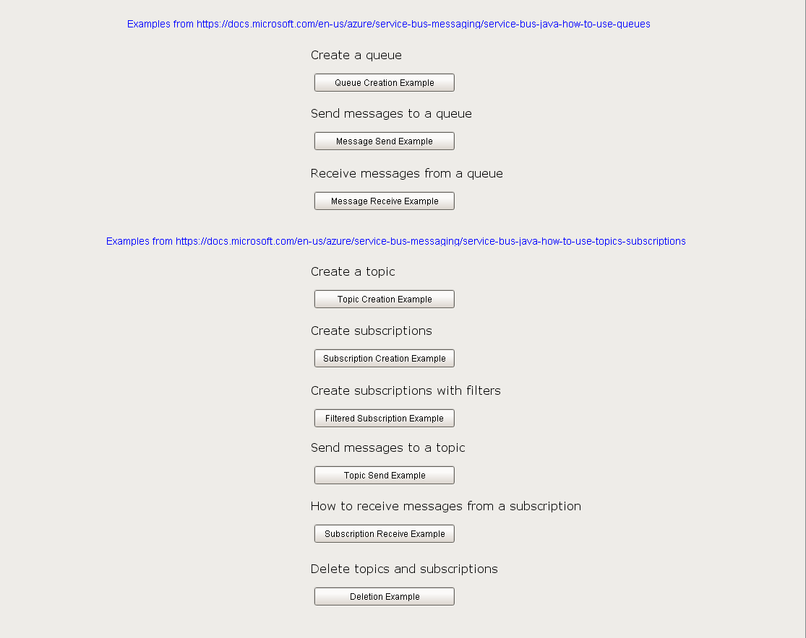

# azureServiceBus
Provides script functions for accessing Azure's Service Bus java library.

# Using the module
You can load the 'Ignition Script Examples Window.proj' into Ignition to get some scripts using Microsoft's examples.

## Build Steps

Do a normal 'mvn package'.

Then

Note that when you compile the module, it has one quirk.  Since the Azure Service Bus java libraries aren't properly signed for packing, you'll need to remove the jar signatures from the library.  After you build the module, you have to remove the .RSA and .SF files from the META-INF folder in the azure jars in the module.
1. Take the built unsigned module, rename it to .zip
2. Extract the zip
3. Find the azurexxxxxxx.jar.pack.gz files, delete these
4. Find the azurexxxxxxx.jar modules, open them in 7-zip
5. Go into META-INF and delete the two .RSA and .SF files
6. Run Java's pack200 to create new .pack.gz files for the two azure .jars
7. Re-zip the files
8. Rename the zip to .modl